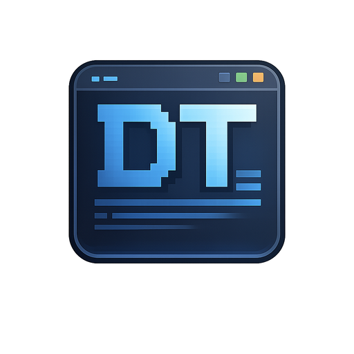

# D-Terminal

**Agent-aware Windows Terminal**

*Tek pencerede çoklu shell, AI entegrasyonu ve uzmanlaşmış pane tipleri*  
*Multi-shell, AI-native, specialized-pane terminal — all in one window*

🌐 **TR · EN** — Bu README iki dillidir / This README is bilingual (English collapsibles below each section)

## 🎬 Demo

https://github.com/AmrasElessar/d-terminal/raw/main/docs/media/d-terminal-showcase.mp4

> 📥 Video oynamıyorsa / If the video doesn't play: [doğrudan indir / direct download](./docs/media/d-terminal-showcase.mp4)

**🛡 Güvenlik / Security**

[-success?logo=virustotal&logoColor=white)](https://www.virustotal.com/gui/file/c82bc54c4b18e0efa6f4cf4a323d51cbec8965617b3c95ec004c47b42a271a06)
[-yellow?logo=virustotal&logoColor=white)](https://www.virustotal.com/gui/file/62bad45a2202729be9e8e29999258677b4008d84f3cf1c3c2565cce762380c76)

[-success)](./src-tauri/tauri.conf.json)

---

## 📌 Kısaca

D-Terminal, Windows kullanıcıları için modern, hızlı ve **AI-yerli** açık kaynaklı bir terminal uygulamasıdır. PowerShell, CMD ve WSL oturumlarını; AI sohbetlerini; sistem bilgisi ve log akışlarını **tek bir pencerede** birleştirir.

**Tauri v2** ile yazıldığı için — Rust core + WebView2 — Electron tabanlı alternatiflerden **5× daha hafif** (~5 MB binary, ~100 MB RAM).

**Kişisel kullanım için** geliştirilen, **MIT lisanslı** bir D Brand projesidir. ARM64 ve x64 mimarileri için **çift mimari (dual-arch)** binary üretir; Windows 10 1809 ve üzeri ile Windows 11'de çalışır.

🇬🇧 At a glance (English)

D-Terminal is a modern, fast, **AI-native**, fully open-source terminal for Windows users. It collapses PowerShell, CMD and WSL sessions, AI conversations, system metrics, and log streams into a **single window**.

Built on **Tauri v2** — Rust core + WebView2 — it is **5× lighter** than Electron-based alternatives (~5 MB binary, ~100 MB RAM).

It is a **personal-use** D Brand project under the **MIT license**. Builds ship for both **ARM64 and x64** Windows; runs on Windows 10 1809+ and Windows 11.

---

## 🆕 Yenilikler — v0.9.x serisi

> v0.1.1'den v0.9.2'ye geçişte D-Terminal mimari ve UX olarak yeniden şekillendi. Aşağıda öne çıkan değişiklikler.

- 🪟 **Frameless pencere** — özel başlık çubuğu, popover komut paleti, native min/max/close (Tauri 2 capabilities izinleri ile)
- 🤖 **AI Agent Watch** — pane başına AI tool-kullanım gözlemcisi, OSC 9999 protokolü, canlı maliyet rozeti, "waiting / running / interrupted" durumları, Claude Code paralel batch parser, otomatik split + heuristik tespit
- 🔄 **Merkezi güncelleme sistemi** — 3 mod (silent / passive / full UI), ARM/x64 dual-arch updater'da entegre
- 🎯 **ARM64 + x64 çift mimari** — Surface Pro X, Snapdragon laptop'lar dahil tam destek
- 📊 **Canlı DFetch** — gerçek zamanlı sistem istatistikleri (CPU/RAM/disk), broadcast UX, snapshot, tema uyumlu overlay
- 🔢 **Pane başına git diff +/- chip** — pane başlığında değişen satır sayısı (OSC 7 cwd + `git shortstat`)
- 🤖 **5 yerel AI runtime** + esnek özel endpoint sağlayıcısı (OpenAI-uyumlu)
- 🏠 **Home dir başlangıç + welcome banner** — D-T logosu, sürüm rozeti, TR locale paneli
- 📋 **Çok satırlı yapıştırma** — bracketed paste modu + satır sayısı toast'u
- ⚡ **Performans** — IPC coalescing, BlockTracker output truncation
- 💖 **GitHub Sponsors entegrasyonu** — 4 tier perk altyapısı, issue/PR template'lerinde sponsor link
- 🔐 **Güvenlik & a11y audit** — FAZ A/B fixleri uygulandı, a11y composable

🇬🇧 What's new — v0.9.x series (English)

> In the v0.9.x series, D-Terminal was substantially reshaped — architecture and UX. Headlines below.

- 🪟 **Frameless window** — custom title bar, popover command palette, native min/max/close (Tauri 2 capabilities permissions wired)
- 🤖 **AI Agent Watch** — per-pane AI tool-use observer, OSC 9999 protocol, live cost badge, "waiting / running / interrupted" states, Claude Code parallel-batch parser, auto-split + heuristic detection
- 🔄 **Centralized updater** — 3 modes (silent / passive / full UI), integrated for both ARM/x64 dual-arch
- 🎯 **ARM64 + x64 dual-architecture** — full support including Surface Pro X and Snapdragon laptops
- 📊 **Live DFetch** — real-time system stats (CPU/RAM/disk), broadcast UX, snapshot, theme-aware overlay
- 🔢 **Per-pane git diff +/- chip** — changed-line counter in pane title (OSC 7 cwd + `git shortstat`)
- 🤖 **5 local AI runtimes** + a flexible custom-endpoint provider (OpenAI-compatible)
- 🏠 **Home-dir startup + welcome banner** — D-T logo, version badge, TR locale panel
- 📋 **Multi-line paste** — bracketed-paste mode + line-count toast
- ⚡ **Performance** — IPC coalescing, BlockTracker output truncation
- 💖 **GitHub Sponsors integration** — 4-tier perk scaffolding, sponsor link in issue/PR templates
- 🔐 **Security & a11y audit** — Phase A/B fixes applied, a11y composable

---

## 🎯 Vizyon

D-Terminal, Windows üzerinde günlük çalışma akışını terminal merkezli yürüten kullanıcılar için, dağıtık araçlara duyulan ihtiyacı tek bir uygulamada toplamayı hedefler. PowerShell, CMD ve WSL oturumlarını; AI sohbetlerini; sistem ve log akışlarını **ortak bir kabuğun altında** birleştirir.

Windows Terminal sağlam bir tab/split altyapısı sunar; D-Terminal bunun üzerine **native AI entegrasyonu**, **output triggers**, **blok tabanlı komut tarihi** ve **profil sistemi** ekleyerek terminali bir geliştirme platformuna dönüştürür.

🇬🇧 Vision (English)

D-Terminal targets Windows users who run their daily workflow from a terminal. It collapses the need for fragmented tools into a single application: PowerShell, CMD, and WSL sessions; AI conversations; system metrics and log streams — **all under one shell**.

Windows Terminal provides a solid tab/split foundation; D-Terminal builds on top with **native AI integration**, **output triggers**, **block-based command history**, and a **profile system** — turning the terminal into a development platform.

---

## ✨ Öne Çıkan Özellikler / Key Features

### 🤖 Yapay Zeka / AI

- **4 sağlayıcı**: Anthropic, OpenAI, Gemini, Ollama (offline) + OpenAI-uyumlu özel endpoint
- **5 yerel runtime** entegrasyonu (Ollama, LM Studio, Jan, Text Generation WebUI, Llama.cpp server)
- **Rust HTTP proxy**: API key Windows DPAPI vault'tan Rust tarafında alınır; frontend hiçbir zaman plaintext key görmez (XSS riski sıfırlandı)
- **Komut üretici**: doğal dilden shell komutu (`Ctrl+Shift+G` modal veya boş prompt'ta `#` interception)
- **Blok'tan AI'a**: terminal komut bloklarını tek tıkla AI Chat'e enjekte et
- **Maliyet takibi**: token + ücret canlı gösterim, oturum toplamı

🇬🇧 AI features (English)

- **4 providers**: Anthropic, OpenAI, Gemini, Ollama (offline) + a custom OpenAI-compatible endpoint
- **5 local-runtime** integrations (Ollama, LM Studio, Jan, Text Generation WebUI, Llama.cpp server)
- **Rust HTTP proxy**: API keys are read from the Windows DPAPI vault on the Rust side; the frontend never sees a plaintext key (XSS risk eliminated)
- **Command generator**: natural language → shell command (`Ctrl+Shift+G` modal or `#` interception in an empty prompt)
- **Block → AI**: send terminal command blocks straight into AI Chat with one click
- **Cost tracking**: live token + price display, per-session totals

### 🛰️ Agent Watch

- **Pane başına AI agent gözlemcisi** — Claude Code, Codex, Aider, Cursor gibi agent'lar koştuğunda otomatik tespit
- **OSC 9999 protokolü** — agent çıktısı sessizce gözlemlenir (tool çağrıları, tamamlanan adımlar, bekleyen onaylar)
- **Canlı maliyet + token rozeti** — başlık çubuğunda + status bar'da gerçek zamanlı
- **Auto-split + heuristik dedektör** — paralel agent batch'leri tespit edilir, görsel olarak ayrılır
- **Durumlar**: `running` / `waiting (input)` / `interrupted` rozetleri

🇬🇧 Agent Watch (English)

- **Per-pane AI agent observer** — auto-detects when agents like Claude Code, Codex, Aider, Cursor are running
- **OSC 9999 protocol** — silently observes agent output (tool calls, completed steps, pending approvals)
- **Live cost + token badge** — in the title bar and status bar, real-time
- **Auto-split + heuristic detector** — parallel agent batches detected and visually separated
- **States**: `running` / `waiting (input)` / `interrupted` badges

### 📦 Blok Tabanlı Komut Tarihi / Block-Based Command History (OSC 133)

- Her komut + çıktı + exit kodu otomatik yakalanır
- Renkli durum: ✓ success / ✗ error / ◌ running / ⊘ aborted
- Komut yeniden çalıştır, çıktı kopyala, AI'a gönder
- PowerShell shell-integration prompt'u yerleşik (CMD da)
- Pane başlığında **git diff +/-** chip (OSC 7 cwd ile)

🇬🇧 Block-based history (English)

- Every command + output + exit code is captured automatically
- Color-coded status: ✓ success / ✗ error / ◌ running / ⊘ aborted
- Re-run a command, copy output, or send to AI
- Built-in PowerShell shell-integration prompt (CMD too)
- **Git diff +/-** chip in the pane title (via OSC 7 cwd)

### 🎯 Output Triggers (iTerm2 paritesi)

- Regex eşleşmesinde otomatik aksiyon: toast, AI'a iletme, snippet çalıştırma
- Cooldown + scope (per shell tipi) kontrolü
- `{{0}}`, `{{1}}` template ile match groups

🇬🇧 Output Triggers (English)

- Auto-action on regex match: toast, AI hand-off, snippet execution
- Cooldown + scope (per shell type) controls
- Match groups via `{{0}}`, `{{1}}` template placeholders

### 🪟 Pane Sistemi / Pane System

- Yatay/dikey split, **sekme başına bağımsız ağaç**
- **Drag-rearrange**: pane başlığını sürükle, başka pane'in 4 kenarından birine bırak
- **Inline rename + grup tag'leri** — çift tık ile yerinde, `#` ile renkli grup (8 renk hash-bazlı)
- Pane zoom modu (tmux `z` paritesi, `Ctrl+Shift+Z`)
- **Broadcast input** — tmux sync-panes; tüm pane'lere paralel klavye
- Çok satırlı yapıştırma — bracketed mode + satır sayısı toast'u
- Context menu: kopya, yapıştır, temizle, böl, kapat

🇬🇧 Pane system (English)

- Horizontal/vertical splits, **per-tab independent tree**
- **Drag-rearrange**: drop a pane title onto another pane's 4 edges
- **Inline rename + group tags** — double-click for in-place edit, `#` for colored grouping (8-color hash-based)
- Pane zoom (tmux `z` parity, `Ctrl+Shift+Z`)
- **Broadcast input** — tmux sync-panes; keystrokes go to every pane in parallel
- Multi-line paste — bracketed mode + line-count toast
- Context menu: copy, paste, clear, split, close

### 🔌 Shell Profilleri / Shell Profiles (iTerm2/Tabby parity)

- Built-in: PowerShell / CMD / WSL
- Kullanıcı tanımlı: SSH host, Docker exec, pwsh 7, Python REPL...
- Her profil: shell + args + cwd + env + ikon + renk badge

🇬🇧 Shell profiles (English)

- Built-in: PowerShell / CMD / WSL
- User-defined: SSH host, Docker exec, pwsh 7, Python REPL, ...
- Per-profile: shell + args + cwd + env + icon + color badge

### 🎨 Tema ve Görünüm / Themes & Appearance

- **14 dahili tema**: D-Dark, D-Light, D-Matrix, D-Nord, D-Dracula, D-TokyoNight, D-Catppuccin, D-Gruvbox, D-Retro, D-Solarized-Dark/Light, D-OneDark, D-RosePine, D-GitHub-Dark
- JSON ile özel tema, runtime renk değişimi
- **Mica / Acrylic / None** — runtime vibrancy switch (Win11 22H2+)
- Ayarlar'da kart-grid önizleme + ANSI swatch'ları

🇬🇧 Themes (English)

- **14 built-in themes**: D-Dark, D-Light, D-Matrix, D-Nord, D-Dracula, D-TokyoNight, D-Catppuccin, D-Gruvbox, D-Retro, D-Solarized-Dark/Light, D-OneDark, D-RosePine, D-GitHub-Dark
- Custom themes via JSON, runtime color swap
- **Mica / Acrylic / None** — runtime vibrancy switch (Win11 22H2+)
- Card-grid preview in Settings + ANSI swatches

### 📊 DFetch — Canlı Sistem Bilgisi / Live System Info (neofetch parity)

- **Canlı stat'lar**: CPU, RAM, disk, ekran + DPI, batarya, tema, locale, timezone, swap, boot time, GPU (WMI)
- **Yerel IP** (IPv4/IPv6) — public IP'ye dokunmaz (offline-first)
- **KVKK/GDPR maskeleme**: hostname + IP varsayılan gizli, 👁 tıklayınca aç/kapa, oturum içi
- **Snapshot + broadcast UX** — pane'ler arası paylaş
- 4-renkli Windows OS logosu (neofetch konvansiyonu)
- 16 ANSI color blocks alttaki bant
- Tema-uyumlu overlay rendering

🇬🇧 DFetch (English)

- **Live stats**: CPU, RAM, disk, display + DPI, battery, theme, locale, timezone, swap, boot time, GPU (WMI)
- **Local IP** (IPv4/IPv6) — never touches public IP (offline-first)
- **GDPR/KVKK masking**: hostname + IP hidden by default; click 👁 to toggle, session-scoped
- **Snapshot + broadcast UX** — share across panes
- 4-color Windows OS logo (neofetch convention)
- 16 ANSI color blocks in the bottom strip
- Theme-aware overlay rendering

### 🔍 xterm Motoru / Engine

- WebGL renderer + Canvas/DOM otomatik fallback
- Scrollback search (`Ctrl+F`, regex/case/word, decoration highlight)
- Sixel + iTerm2 inline image protokolleri
- Unicode 11 (emoji + CJK doğru genişlik)
- Smart link: file path, git SHA, IP/host tıklanabilir
- Buffer serialize → clipboard

🇬🇧 xterm engine (English)

- WebGL renderer + automatic Canvas/DOM fallback
- Scrollback search (`Ctrl+F`, regex/case/word, decoration highlight)
- Sixel + iTerm2 inline image protocols
- Unicode 11 (correct width for emoji + CJK)
- Smart links: file paths, git SHAs, IPs/hosts are clickable
- Buffer serialize → clipboard

### ⌨️ Klavye-first / Keyboard-first

- 24 varsayılan kısayol, **kapsayıcı editör** (Ayarlar → Kısayollar)
- Tuş yakalama capture overlay, çakışma tespiti, override persist
- Command palette (`Ctrl+Shift+P`) — popover stil
- Quake hotkey (`F1` — pencere göster/gizle)

🇬🇧 Keyboard-first (English)

- 24 default shortcuts, **comprehensive editor** (Settings → Shortcuts)
- Key-capture overlay, conflict detection, override persistence
- Command palette (`Ctrl+Shift+P`) — popover style
- Quake hotkey (`F1` — show/hide window)

### 🔒 Güvenlik / Security

- Windows DPAPI ile credential storage (master parola yok)
- AI key Rust tarafında, frontend'e sızmaz
- CSP enforced (`script-src 'self'`), `wasm-unsafe-eval` limited
- FAZ A/B güvenlik audit fixleri uygulandı (M7/M8 kritik)

🇬🇧 Security (English)

- Credential storage via Windows DPAPI (no master password)
- AI keys live on the Rust side and never leak to the frontend
- CSP enforced (`script-src 'self'`), `wasm-unsafe-eval` limited
- Phase A/B security audit fixes applied (critical M7/M8)

### 💾 Kalıcılık / Persistence

- Session restore (layout + komut geçmişi)
- SQLite WAL mode, kullanıcı dosyalarına dokunmaz
- Snippet & history full-text search
- PSReadLine geçmiş içe aktarma

🇬🇧 Persistence (English)

- Session restore (layout + command history)
- SQLite WAL mode, keeps user files untouched
- Full-text search across snippets & history
- PSReadLine history import

### 🚀 Mimari / Architecture

- **Tauri v2** — Rust core + WebView2, ~5 MB binary, ~100 MB RAM (Electron 5× daha hafif)
- Length-prefixed binary IPC ile node-pty sidecar (ADR-0001), pkg-bundled standalone (Node.js gereksiz)
- Heartbeat tabanlı zombi-koruma (Tauri crash → sidecar otomatik kapanır)
- IPC coalescing performans optimizasyonu
- Merkezi updater (silent/passive/full UI 3 mod) — ARM/x64 dual-arch entegre

🇬🇧 Architecture (English)

- **Tauri v2** — Rust core + WebView2, ~5 MB binary, ~100 MB RAM (5× lighter than Electron)
- Length-prefixed binary IPC to a node-pty sidecar (ADR-0001), pkg-bundled standalone (no Node.js needed)
- Heartbeat-based zombie protection (Tauri crash → sidecar exits automatically)
- IPC coalescing for performance
- Centralized updater (silent / passive / full UI — 3 modes) — integrated with ARM/x64 dual-arch

---

## 🛠️ Teknoloji / Tech Stack

| | |
|---|---|
| **Tauri v2** | Rust core + WebView2 |
| **Vue 3** | TypeScript + Vite |
| **xterm.js** | WebGL/canvas renderer, OSC 133, image addon, search, Unicode 11 |
| **node-pty** | sidecar PTY köprüsü / bridge (`@yao-pkg/pkg` ile standalone exe) |
| **rusqlite** | yerel storage / local storage (WAL mode) |
| **Windows DPAPI** | secret storage |

### 📐 Mimari Belgeler / Architecture Documents

Mimari kararlar ve detaylı tasarım için: [docs/architecture-v1.1.md](./docs/architecture-v1.1.md) ve [ADR'lar / ADRs](./docs/adr/).

---

## 🗺️ Yol Haritası / Roadmap

| Sürüm / Version | Hedef / Target | İçerik / Content |
|---|---|---|
| **v1.0** | 3-4 ay / months | Çoğu özellik mevcut; release polish + test + docs / most features in place; release polish + tests + docs |
| **v1.0.5** | +2 ay / months | vue-i18n 11 migration (CSP `unsafe-eval` kaldır / drop), Log Stream pane, snippet senkron / sync |
| **v1.1** | +3 ay / months | Gelişmiş SSH (config.ssh okuyucu / reader), free-form grid layout, Lua/JS programmatic config |
| **v2.0** | — | Multi-agent orkestrasyon / orchestration, terminal AI assist (Warp Drive style team sharing), Kitty graphics protocol |

---

## 📥 Kurulum / Installation

### En çok kullanılan / Most common (v0.9.2)

| Senin için / For you | İndir / Download |
|---|---|
| 💻 **Modern Windows PC** (Intel / AMD) | [`D-Terminal_0.9.2_x64_tr-TR.msi`](https://github.com/AmrasElessar/d-terminal/releases/latest/download/D-Terminal_0.9.2_x64_tr-TR.msi) |
| 🪶 **ARM64 cihaz** (Surface Pro X, Snapdragon laptop) | [`D-Terminal_0.9.2_arm64_tr-TR.msi`](https://github.com/AmrasElessar/d-terminal/releases/latest/download/D-Terminal_0.9.2_arm64_tr-TR.msi) |

> Hangi mimariye sahip olduğundan emin değilsen / Not sure which arch?  
> `Ayarlar / Settings → Sistem / System → Hakkında / About → Sistem türü / System type`

📦 Diğer indirme seçenekleri / Other downloads (NSIS, EN locale)

[GitHub Releases sayfası / page](https://github.com/AmrasElessar/d-terminal/releases) — tüm dosyalar / all files:

| Dosya / File | Mimari / Arch | Açıklama / Description |
|---|---|---|
| `D-Terminal_0.9.2_x64_en-US.msi` | x86_64 | English MSI installer |
| `D-Terminal_0.9.2_x64-setup.exe` | x86_64 | NSIS — TR/EN dil seçici tek dosya / single file with TR/EN language picker |
| `D-Terminal_0.9.2_arm64_en-US.msi` | aarch64 | ARM64 English |
| `D-Terminal_0.9.2_arm64-setup.exe` | aarch64 | ARM64 NSIS |

> 🇹🇷 Boyut artışı (önceki ~22 MB → 40 MB MSI) Node.js runtime'ın bundle'a gömülmesinden kaynaklanır — kullanıcıda Node.js gereksinim **kalktı**.  
> 🇬🇧 The size increase (previously ~22 MB → 40 MB MSI) comes from embedding the Node.js runtime — there is **no longer any Node.js requirement** on the user's side.

---

## 🚀 İlk Adımlar / Quick Start

Kurulumdan sonra D-Terminal'i ilk açtığında deneyebileceğin **5 hızlı şey**:

1. **`Ctrl+Shift+P`** → komut paleti aç (her şey burada — tema değiştir, pane böl, profil seç, settings...)
2. **Boş satıra `#` yaz, sonra doğal dil yaz** → AI senin yerine shell komutu üretir (örn: `# son 10 dosya değişikliğini göster` → `git log --diff-filter=M -10`)
3. **Pane başlığını sürükle**, başka bir pane'in kenarına bırak → otomatik split
4. **`F1`** → pencereyi gizle/göster (Quake mode, dilediğin an çağırılabilir terminal)
5. **`Ctrl+Shift+G`** → AI komut üretici modal'ı (boş prompt'a `#` ile aynı, ama her zaman erişilebilir)

> 💡 Tüm 24 kısayolu görmek/değiştirmek için: **Ayarlar → Kısayollar**  
> 💡 İlk çalıştırmada **AI sağlayıcı eklemek için**: Ayarlar → AI Sağlayıcılar → API key gir (DPAPI vault'ta şifrelenir)

🇬🇧 Quick Start (English)

After installing, here are **5 quick things** to try when you first open D-Terminal:

1. **`Ctrl+Shift+P`** → open the command palette (everything is here — switch theme, split pane, pick profile, settings, ...)
2. **Type `#` on an empty line, then natural language** → AI generates a shell command for you (e.g., `# show the last 10 modified files` → `git log --diff-filter=M -10`)
3. **Drag a pane title** onto another pane's edge → auto-split
4. **`F1`** → hide/show the window (Quake mode — terminal you can summon any time)
5. **`Ctrl+Shift+G`** → AI command generator modal (same as `#` on empty prompt, but always reachable)

> 💡 To view/change all 24 shortcuts: **Settings → Shortcuts**  
> 💡 To add an AI provider on first run: **Settings → AI Providers** → enter API key (encrypted in the DPAPI vault)

---

## 🛡️ Güvenlik Tarama Sonuçları / Security Scan Results

> 🇹🇷 v0.9.2 build'i yayınlandığında VirusTotal + Hybrid Analysis taramaları yenilenecek; aşağıdaki referans sonuçlar son kararlı yayında alınmıştır.  
> 🇬🇧 VirusTotal + Hybrid Analysis scans will be refreshed when the v0.9.2 build ships; the reference results below come from the last stable release.

Tüm 6 dosya / all 6 files: **VirusTotal** + **Hybrid Analysis MetaDefender** — detay / details: [RELEASE_NOTES.md](./RELEASE_NOTES.md)

**ARM64** ✨
- **MSI TR**: [0/57 clean](https://www.virustotal.com/gui/file/13ec82c543a05e48d897a1735582264a3af97d89694799dc8d9eb8751992afec) ✅
- **MSI EN**: [0/57 clean](https://www.virustotal.com/gui/file/11a371cb957821567cbd4abed1cdcac60cef06d166778300b95902a0b11b8feb) ✅
- **NSIS setup**: [1/70](https://www.virustotal.com/gui/file/ef7edc19b301adf61ca8e0f80e3c5980883b537f8f939a0bf993a177c4c6b927) — sadece / only Sophos ML PUA (typical unsigned NSIS)

**x64**
- **MSI TR**: [2/57](https://www.virustotal.com/gui/file/c82bc54c4b18e0efa6f4cf4a323d51cbec8965617b3c95ec004c47b42a271a06) — Antiy-AVL + Rising generic ML false positive
- **MSI EN**: [2/58](https://www.virustotal.com/gui/file/4b75ea036cf61201a6fea40adb151a044fc69bcae35a73a09aca17d2ec64f3ad) — same two engines
- **NSIS setup**: [2/70](https://www.virustotal.com/gui/file/62bad45a2202729be9e8e29999258677b4008d84f3cf1c3c2565cce762380c76) — Sophos ML PUA + VirIT

Microsoft Defender, Kaspersky, BitDefender, ESET, Symantec, McAfee, CrowdStrike, Trend Micro, Fortinet — **hepsi clean / all clean**.  
Hybrid Analysis MetaDefender Multi-Scan: **6/6 dosya clean / files clean**.

> 🇹🇷 Code signing eksik (SignPath FOSS başvurusu sürecinde) — Windows SmartScreen "Bilinmeyen yayıncı" uyarısı verir, "Yine de çalıştır" ile devam edilir. Sertifika sonrası bu kalkar; ML false positive'lerin de neredeyse hepsi düşer.  
> 🇬🇧 Code signing is pending (SignPath FOSS application in progress) — Windows SmartScreen will warn "Unknown publisher"; click "Run anyway" to continue. After signing, the warning goes away and most ML false positives drop too.

### 💻 Sistem Gereksinimleri / System Requirements

- Windows 10 1809 (ConPTY için / for ConPTY) veya / or Windows 11
- ~80 MB RAM, ~15 MB disk
- WebView2 runtime (Win11'de yerleşik / built-in on Win11; Win10'da ilk kurulumda otomatik gelir / auto-installed on Win10 first run)

---

## 🤝 Katkı / Contributing

Bu proje **kişisel bir Windows terminal projesidir** ve topluluk katkı kapsamı bilinçli olarak dar tutulmuştur. Çekirdek mimari ve özellik geliştirme tek elden ilerliyor — ama topluluğun değer katabileceği iki şerit açık.

| ✅ Kabul edilen / Accepted | ❌ Şu an kabul edilmeyen / Not currently accepted |
|---|---|
| 🐛 Bug raporu / Bug reports | 🤖 AI provider adapter PR'ı / PRs |
| 💡 Feature **fikri / ideas** (Issue) | 🏗️ Mimari / refactor PR'ı / PRs |
| 🌍 Dil paketi / Language packs (`src/locales/<kod \| code>.json`) | ✨ Özellik kodu PR'ı / Feature code PRs |
| 🎨 Tema / Themes (`themes/D-<isim \| name>.json`) | |

> `src/locales/` altında **30+ stub dil dosyası** çevirmen bekliyor (Almanca, İspanyolca, Fransızca, Japonca, Çince, Arapça, Rusça, …)  
> *30+ stub language files under `src/locales/` await translators (German, Spanish, French, Japanese, Chinese, Arabic, Russian, …)*

Detaylar / Details: [CONTRIBUTING.md](./CONTRIBUTING.md) · [Tema rehberi / Theme guide](./themes/COMMUNITY.md)

🇬🇧 Contributing (English)

This is a **personal Windows terminal project** and the community contribution scope is intentionally narrow. Core architecture and feature work are owned by the maintainer — but two lanes are open where the community can add real value: language packs and themes. See the table above and [CONTRIBUTING.md](./CONTRIBUTING.md) for details.

---

## 🎨 D Brand Ailesi / D Brand Family

D-Terminal, D Brand ailesinin Windows ayağıdır. Aile üyeleri "Denizhan" adından ilham alır:

| Ürün / Product | Platform | Açıklama / Description |
|---|---|---|
| **D-Player** | Android | Kişisel müzik çalar, DSP motoru / personal music player with DSP engine *(in development)* |
| **DCar Launcher** | Android (Auto) | Head Unit araç içi OS katmanı / Head Unit in-car OS layer *(in development)* |
| **D-Watchtower** | — | Gözetim ve izleme platformu / surveillance & monitoring platform *(in development)* |
| **D-Terminal** | Windows | Agent-aware terminal *(this project, pre-alpha)* |

---

## 💖 Sponsorlar / Sponsors

D-Terminal açık kaynak (MIT) ve sürekli geliştiriliyor. Sponsorluk doğrudan **yeni uygulama geliştirmeye** dönüşür — yapılacaklar listesinde 6 fikir daha var.

🇬🇧 Sponsors (English)

D-Terminal is open source (MIT) and actively developed. Sponsorships translate directly into **new app development** — six more ideas in the queue.

<!-- SPONSORS:HERO -->
<!-- Hero tier ($25/ay · /mo) sponsorları buraya pinlenir / are pinned here -->
<!-- /SPONSORS:HERO -->

<!-- SPONSORS:LIST -->
Henüz sponsor yok / No sponsors yet. **İlk sponsor sen ol / Be the first →** [github.com/sponsors/AmrasElessar](https://github.com/sponsors/AmrasElessar)
<!-- /SPONSORS:LIST -->

---

## 📜 Lisans / License

MIT © Orhan Engin OKAY — bkz / see [LICENSE](./LICENSE)
